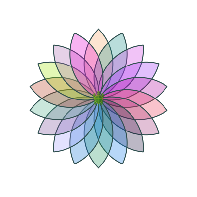

## The Shape/Block method
The shape/block method builds upon the forty patterns at the end of the getting started book. 

There, you had focused on analysing a given pattern, determining the shape and the block present in the pattern, and then drawing the pattern in a structured and systematic way.

Here, we will use the shape/block method to design new patterns.
* [Quick Recap](#quick-recap)
* [Block rotates in place](#block-rotates-in-place)
* [Block rotates around circle](#block-rotates-around-circle)
* [Block moves around grid](block-moves-around-grid)

### Quick Recap
* In any pattern, the **shape** is the core shape that makes up the pattern.
* The **block** draws the shape and then moves/turns the turtle so that it's ready to draw the next shape.
  * Note - after the turtle draws a shape, its position and heading should be the same as they were before drawing the shape - so that the block can easily combine multiple shapes. The `savePosHe()` and `restorePosHe()` commands can be used at the beginning and the end respectively of the `shape()` command to help accomplish this.
* Once the shape and the block are in place, the pattern is drawn by repeating the block the desired number of times.

Here's a drawning based on the above idea:
```scala
def shape() {
    // savePosHe() not needed here as turtle ends up at its starting state
    repeat(5) {
        forward(100)
        right(360/5)
    }
}

def block() {
    setFillColor(randomColor.fadeOut(0.7))
    shape()
    right(20)
}

clear()
setSpeed(fast)
setPenColor(cm.darkSlateGray)
repeat(18) {
    block()
}
```


### Block rotates in place
```scala
def shape() {
    savePosHe()
    left(45)
    right(90, 100)
    right(90)
    right(90, 100)
    restorePosHe()
}

def block() {
    setFillColor(randomColor.fadeOut(0.7))
    shape()
    // rotate in place
    right(20)
}

clear()
setSpeed(fast)
setPenColor(cm.darkSlateGray)
repeat(18) {
    block()
}
```


### Block rotates around circle
```scala
def shape() {
    savePosHe()
    left(45)
    right(90, 100)
    right(90)
    right(90, 100)
    restorePosHe()
}

def block() {
    setFillColor(randomColor.fadeOut(0.7))
    shape()
    penUp()
    // rotate around circle of radius 200
    right(20, 200)
    penDown()
}

clear()
setSpeed(fast)
setPenColor(cm.darkSlateGray)
repeat(18) {
    block()
}
```


### Block moves around grid
Todo