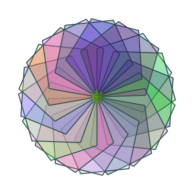
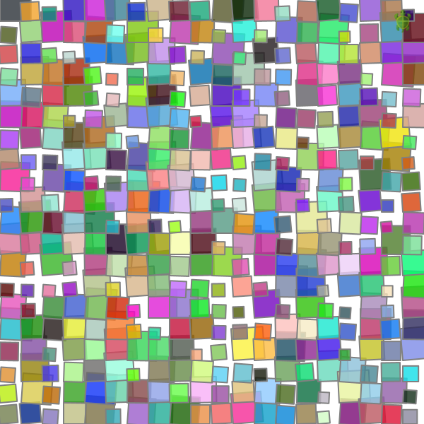

<div class="nav">
  <a href="../index.html">Home</a> | <a href="../turtle-index.html">Turtle Graphics</a>
</div>

## The Shape/Block method
The shape/block method builds upon the ideas in the forty-patterns section at the end of the [Getting Started](http://wiki.kogics.net/kojo-codeactive-books#getting-started) book. 

In that section you focused on analysing a given pattern, determining the shape and the block present in the pattern, and then drawing the pattern in a structured and systematic way using the shape/block method.

Here, you will use the shape/block method to *design new patterns*.
* [Quick Recap](#quick-recap)
* [Block rotates in place](#block-rotates-in-place)
* [Block rotates around circle](#block-rotates-around-circle)
* [Block rotates around spiral](#block-rotates-around-spiral)
* [Block moves around grid](#block-moves-around-grid)

### Quick Recap
* In any pattern, the **shape** is the core shape that makes up the pattern.
* The **block** draws the shape and then moves/turns the turtle so that it's ready to draw the next shape.
  * Note - after the turtle draws a shape, its position and heading should be the same as they were before drawing the shape - so that the block can easily combine multiple shapes. The `savePosHe()` and `restorePosHe()` commands can be used at the beginning and the end respectively of the `shape()` command to help accomplish this.
* Once the shape and the block are in place, the pattern is drawn by repeating the block the desired number of times.

To implement the above ideas, it's good to know [how defs work](../reference/turtle.html#def).

Here's a drawning based on the above ideas:

---

```scala
def shape() {
    // savePosHe() not needed here as turtle ends up at its starting state
    repeat(5) {
        forward(100)
        right(360/5)
    }
}

def block() {
    setFillColor(randomColor.fadeOut(0.7))
    shape()
    right(20)
}

clear()
setSpeed(fast)
setPenColor(cm.darkSlateGray)
repeat(18) {
    block()
}
```


---

### Block rotates in place
In this approach, the block just rotates the shape around a point:

---

```scala
def shape() {
    savePosHe()
    left(45)
    right(90, 100)
    right(90)
    right(90, 100)
    restorePosHe()
}

def block() {
    setFillColor(randomColor.fadeOut(0.7))
    shape()
    // rotate in place
    right(20)
}

clear()
setSpeed(fast)
setPenColor(cm.darkSlateGray)
repeat(18) {
    block()
}
```


---

### Block rotates around circle
In this approach, the block rotates the shape around the boundary of a circle:

---

```scala
def shape() {
    savePosHe()
    left(45)
    right(90, 100)
    right(90)
    right(90, 100)
    restorePosHe()
}

def block() {
    setFillColor(randomColor.fadeOut(0.7))
    shape()
    penUp()
    // rotate around circle of radius 200
    right(20, 200)
    penDown()
}

clear()
setSpeed(fast)
setPenColor(cm.darkSlateGray)
repeat(18) {
    block()
}
```


---

### Block rotates around spiral
In this approach, the block moves the shape around the boundary of a spiral:

---

```scala
clear()
setSpeed(fast)
setPenColor(darkGray)

def shape() {
    circle(10)
}

def block(n: Int) {
    setFillColor(randomColor.fadeOut(0.2))
    shape()
    penUp()
    right(15, n*2)
    penDown()
}

repeatFor(1 to 150) { n =>
    block(n)
}
```


---

### Block moves around grid
In this approach, the block moves the shape around a grid that spans the canvas.

---

```scala
clear()
setBackground(white)
setSpeed(superFast)
setPenColor(cm.gray)

val nx = 20
val ny = 20
val cb = canvasBounds
val dx = cb.width / nx
val dy = cb.height / ny

def shape() {
    savePosHe()
    right(random(-5, 5))
    val len = dy / 2 + randomDouble(dx)
    repeat(4) {
        forward(len)
        right(90)
    }
    restorePosHe()
}

def posx(gx: Int) = cb.x + gx * dx
def posy(gy: Int) = cb.y + gy * dy

def block(gx: Int, gy: Int) {
    setPosition(posx(gx), posy(gy))
    setFillColor(randomColor.fadeOut(0.2))
    shape()
}

repeatFor(0 until nx) { x =>
    repeatFor(0 until ny) { y =>
        block(x, y)
    }
}
```


---