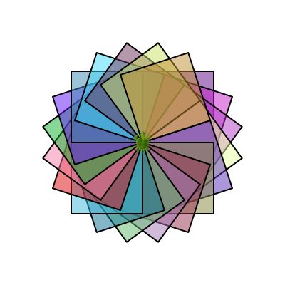

## Core concepts

Making drawings and art in Kojo with the help of the turtle is easy. You just need to be familiar with the following core ideas:
* Your program to make a drawing contains a sequence of lines containing commands. When you run your program, it does its job line by line, carrying out the commands from the top of the program to the bottom.
* As your program runs line by line, it draws stuff on the canvas by giving commands to the turtle.
* All straight lines on the canvas are made by the `forward(numSteps)` command, which draws a (straight) line in the direction of the turtle's nose.
* The `right(angle)` and `left(angle)` commands change the direction of the turtle's nose.
* All curved lines on the canvas are made by the `right(angle, radius)` and `left(angle, radius)` commands.
* If you want to move the turtle around the canvas without drawing lines, you have the following options:
  * use the `hop(numSteps)` command.
  * do a `penUp()`, do forwards, rights, etc. as desired, and then do a `penDown()`.
  * do a `setPosition(x, y)`.
* You need to know just a handful of turtle commands to make great drawings. These commands are [listed on the commands reference](/reference/turtle.html) page.
* You can use the `repeat` command to run a bunch of commands many times. This can make your programs shorter and easier to understand.
* If your program does a particular thing many times, you can give this thing a name and teach Kojo a new command with this name - using the `def` instruction.
* To draw colorful lines, use the `setPenColor(color)` command.
* To draw colorful filled areas, use the `setFillColor(color)` command.
* The above couple of commands need you to give them colors as inputs. You can do this in the following ways:
  * Use the `randomColor` or `randomColor.fadeOut(fraction)` functions to let Kojo choose a random color for you.
  * Use the `ColorMaker` (short-form: `cm`) - in the following ways:
    * Whereever a color is needed in your program, type `cm.` in the script editor and then type `Ctrl+Space`. This will pop-up a list of around 80 pre-defined colors. Select a color from this list and hit enter to get that color into your program.
    * `Ctrl+Click` on any color in your program to bring up a color chooser. Inside the color chooser, you can visually select a color, or manually modify the hue, saturation, lightness, and/or transparency of your desired color.
* To draw thick or thin lines, use the `setPenThickness(thickness)` command.

Here are some examples showing the above ideas in action:
* * *
Code:
```scala
clear()
def square() {
    repeat(4) {
        forward(100)
        right(90)
    }
}

clear()
setSpeed(fast)
setPenColor(cm.black)
repeat(20) {
    setFillColor(randomColor.fadeOut(0.5))
    square()
    right(18)
}
```
Output:  

* * *