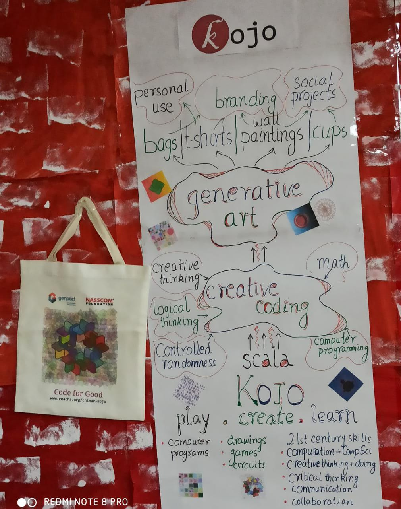
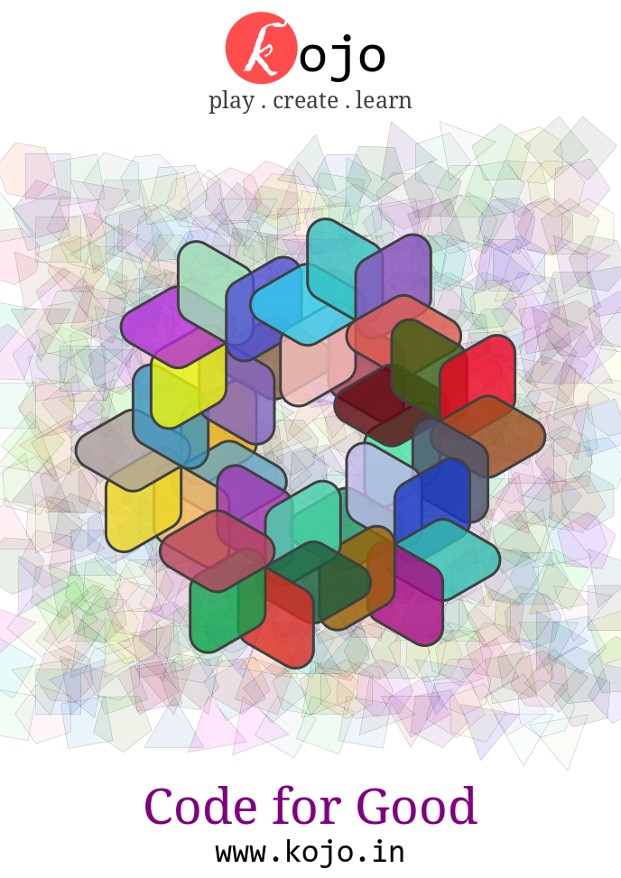

  <a href="../index.html">Home</a> | <a href="../fundamentals-index.html">Fundamentals</a>

## Kojo Strengths

A big strength of Kojo is that it brings together a powerful programming language, a strong (but easy to use) programming environment, and rich areas of programming with opportunities for physical product development and real-world impact.

Individually, each of the above features is very useful to have in a programming environment. Collectively, these features enable Kojo to provide a very fertile space for empowered exploration, discovery, creation, innovation, and learning.

### A powerful language
[Scala](http://scala-lang.org), the programming language used in Kojo, has great (arguably better than any other language in the world) support for the most important and widely used programming/computing ideas and paradigms:
* modular programming
* object-oriented programming  
* functional programming
* concurrent programming

Kids learning programming in Kojo get to see these ideas in a theoretically clean but also practically very usable and rich context. These learned ideas can then be transferred very easily to other languages like Python, Javascript, and Java.

### A modern programming environment
Kojo has the following features to support the flow of programming:
* Syntax highlighting.
* Code completion.
* Interactive Program Manipulation.
* Online help.
* Strong feedback loop - instant feedback for graphics and console based programming.
* Program data exploration via Worksheet mode or Explorer pane.
* Program tracing.
* Lightweight breakpoints.
* Line-by-line program running.
* Searchable program history.
* And more...

### Rich areas of programming

Kojo has very good support for [many exciting and rich areas](/modules/modules-index.html) in which children can write programs, leading to great opportunities for learning.

#### Physical product development opportunities
Kojo has excellent support for creative coding and generative art, which can be used to create exciting designs that can be printed on t-shirts, carry bags, posters, back-packs, cups, caps, etc. This enables children to build things that they can use, showcase, and potentially sell (for good causes). This in turn provides tremendous motivation and multi-dimensional learning and growth opportunities. Here's a picture of a Kojo poster (and a Kojo-designed carry bag) showing some of these ideas in action:

---

And here is a sample t-shirt design done in Kojo:

---

