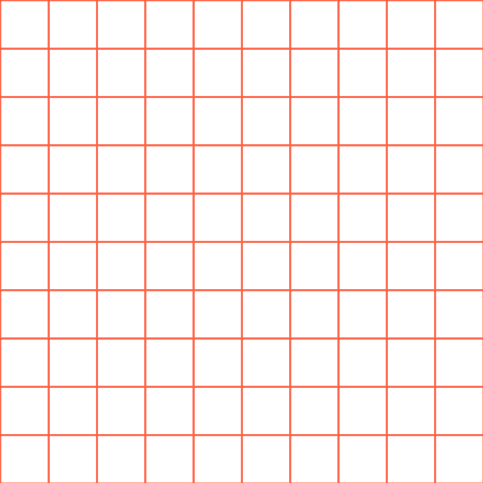
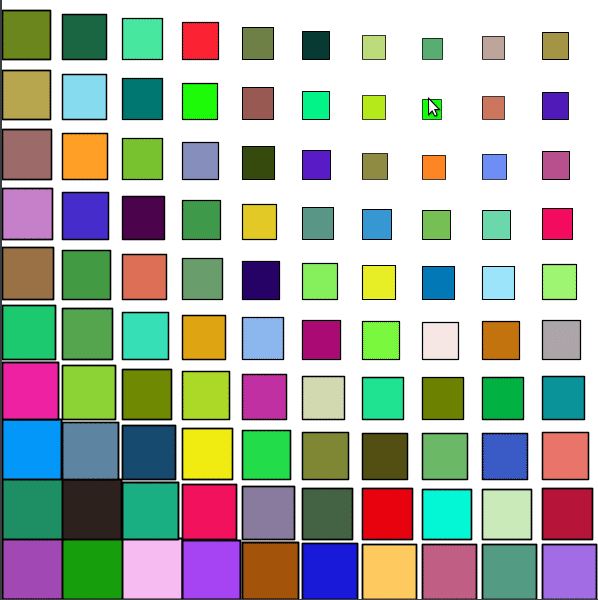
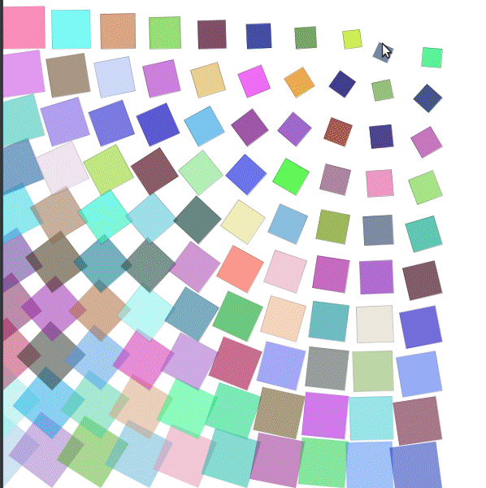

<div class="nav">
  <a href="../index.html">Home</a> | <a href="../picture-index.html">Picture Graphics</a> | <a href="../tutorials-index.html">Tutorials</a>
</div>

## An introduction to grid based generative art

Generative art is art that is generated via an interaction between a computer program and a human being. The programmer-artist writes a program to make the art. The program can contain elements of randomness in it. The program can also be driven by interaction with the programmer-artist (via mouse, keyboard, etc). The programmer-artist runs the program, interacts with it, looks at the output, modifies the program as desired, re-runs it, and iteratively contiues doing this till the final output is to his liking. The final output can then be printed to a physical medium (like a t-shirt, bag, wall canvas, cup, cap, backpack, etc).

In this tutorial, you will play with generative art in the context of a grid. Here is what you will do:
* [Make a grid of squares using turtle graphics](#turtle-graphics-grid) - to get going.
* [Make the same grid using Pictures](#picture-grid) - to start to use the power of pictures in your generative art.
* [Make the grid dynamic](#dynamic-picture-grid), so that as you move the mouse over the grid, it changes. In this section you will play with various forms of dynamism.
* [Work with irregular grids](#irregular-grid), where the sizes of the grid cells are different.


### Turtle graphics grid
To get going, you will make a grid of squares on the canvas. For this, you will use the [shape/block idea](https://litan.github.io/kojodoc/art/shape-block.html) that you are familiar with:
* The shape for the pattern is a square
* The block positions the turtle at the bottom left of every grid cell, and then makes the shape.

**Quick Reference:**
* `size(w, h)` - sets the size of the canvas to the given width and height.
* `cwidth` - returns the current width of the canvas.
* `cheight` - returns the current height of the canvas.
* `originBottomLeft()` - situates the origin at the bottom left of the canvas.
* `rangeTill(from, untill, step)` - returns a range that starts from `from`, goes until (but excluding) `until`, and steps up by `step`. See examples below:
```scala
rangeTill(4, 10, 2).toArray //> res16: Array[Int] = Array(4, 6, 8)
rangeTill(4, 11.5, 2.5).toArray //> res17: Array[BigDecimal] = Array(4.0, 6.5, 9.0)
```

Type in the following code and run it. Look at the output. Make sure you understand how the output is generated.

---

```scala
size(600, 600)
cleari()
originBottomLeft()
setSpeed(superFast)
setBackground(white)
setPenColor(black)

val tileCount = 10
val tileSize = cwidth / tileCount

def shape() {
    repeat(4) {
        forward(tileSize)
        right(90)
    }
}

def block(posX: Double, posY: Double) {
    setPosition(posX, posY)
    shape()
}

repeatFor(rangeTill(0, cheight, tileSize)) { posY =>
    repeatFor(rangeTill(0, cwidth, tileSize)) { posX =>
        block(posX, posY)
    }
}
```


---

### Picture grid
Now, you will make the same grid as above (except for the pen color), but using Pictures. The one big change here is that `shape` is no longer a command, but it is a function instead. Earlier the `block` command used to position the turtle appropriately and call the `shape` command. Now the `block` command creates a shape via the `shape` function, positions it appropriately, and then draws it.

---

```scala
size(600, 600)
cleari()
originBottomLeft()
setBackground(white)

val tileCount = 10
val tileSize = cwidth / tileCount

def shape = Picture.rectangle(tileSize, tileSize)

def block(posX: Double, posY: Double) {
    val pic = shape
    pic.setPosition(posX, posY)
    pic.setPenColor(cm.tomato)
    draw(pic)
}

repeatFor(rangeTill(0, cheight, tileSize)) { posY =>
    repeatFor(rangeTill(0, cwidth, tileSize)) { posX =>
        block(posX, posY)
    }
}
```



---

#### Exercise
Try out different picture shapes in the grid.

### Dynamic Picture Grid

For the next set of patterns, you will make the grid dynamic. Here, *dynamic* means that as you move the mouse over the grid, the grid-pattern will change. 

There are many ways to make a grid dynamic, but you will work with the following approach in this tutorial:

For every picture in the grid:
* note the position (posX, posY) of the picture.
* determine its distance from the mouse position (mouseX, mouseY).
* determine its angle from the mouse position.
* use the distance to scale and fade out the picture.
* use the angle to rotate the picture.

**Quick Reference:**
* `setup { drawing code }` - calls the drawing code once at the beginning of your program.
* `drawLoop { drawing code }` - calls the drawing code at the default refresh rate, which is 50 times a second.
* `setRefreshRate(n)` - sets the refresh rate to `n` times per second. The next time a `clear()` is done, the refresh rate is reset to its default value of 50.
* `erasePictures()` - erases all the pictures in the canvas.
* `mathx.map(value, low1, high1, low2, high2)` - maps the given value from the range `(low1, high1)` to the range `(low2, high2)`
* `mathx.distance(x1, y1, x2, y2)` - calculates the distance between (x1, y1) and (x2, y2).
* `mathx.angle(x1, y1, x2, y2)` - calculates the angle in degrees between the line from (x1, y1) to (x2, y2) and the horizontal.

In this first *dynamic* example, you will work with a simple shape (a rectangle), and make the grid-pattern dynamic by (only) scaling the pictures in it.

Type in the following code and run it. Look at the output. Make sure you understand how the output is generated.

---

```scala
size(600, 600)
cleari()
setBackground(white)
originBottomLeft()

val tileCount = 10
val tileWidth = cwidth / tileCount
val tileHeight = cheight / tileCount

def shape = Picture.rectangle(tileWidth, tileHeight)

def block(posX: Double, posY: Double) {
    val pic = shape
    pic.setPosition(posX, posY)
    pic.setPenColor(cm.darkBlue)
    val d = mathx.distance(posX, posY, mouseX, mouseY)
    val f = mathx.map(d, 0, 500, 0.3, .9)
    pic.scale(f)
    draw(pic)
}

drawLoop {
    erasePictures()
    repeatFor(rangeTill(0, cheight, tileHeight)) { posY =>
        repeatFor(rangeTill(0, cwidth, tileWidth)) { posX =>
            block(posX, posY)
        }
    }
}
```


---

#### Exercise
* Try out different picture shapes in the grid.
* Experiment with differernt scaling schemes.

In the second *dynamic* example, you will also fade out grid pictures as the mouse moves over the grid.

Type in the following code and run it. Look at the output. Make sure you understand how the output is generated.

---

```scala
size(600, 600)
cleari()
setBackground(white)
originBottomLeft()

val tileCount = 10
val tileWidth = cwidth / tileCount
val tileHeight = cheight / tileCount

def shape = Picture.rectangle(tileWidth, tileHeight)

def block(posX: Double, posY: Double) {
    val pic = shape
    pic.setPosition(posX, posY)
    val d = mathx.distance(posX, posY, mouseX, mouseY)
    val f = mathx.map(d, 0, 500, 0.2, .7)
    pic.scale(f)
    pic.setPenColor(black.fadeOut(f))
    draw(pic)
}

draw {
    erasePictures()
    repeatFor(rangeTill(0, cheight, tileHeight)) { posY =>
        repeatFor(rangeTill(0, cwidth, tileWidth)) { posX =>
            block(posX, posY)
        }
    }
}
```


---

In the third and final *dynamic* example, you will also rotate the grid pictures as the mouse moves over the grid. Plus you will use a square-spiral shape instead of a rectangle for a nicer effect.

Type in the following code and run it. Look at the output. Make sure you understand how the output is generated.

---

```scala
size(600, 600)
cleari()
setBackground(white)
originBottomLeft()

val tileCount = 20
val tileWidth = cwidth / tileCount
val tileHeight = cheight / tileCount

def shape = Picture {
    repeatFor(30 to 70) { n =>
        forward(n)
        right(91)
    }
}

def block(posX: Double, posY: Double) {
    val pic = shape
    pic.setPosition(posX, posY)
    val angle = mathx.angle(posX, posY, mouseX, mouseY)
    val dist = mathx.distance(posX, posY, mouseX, mouseY)
    val f = mathx.map(dist, 0, 500, 0.2, 0.8)
    pic.scale(f)
    pic.setPenColor(black.fadeOut(f))
    pic.setPenThickness(1)
    pic.rotate(angle)
    draw(pic)
}

drawLoop {
    erasePictures()
    repeatFor(rangeTill(0, cheight, tileHeight)) { posY =>
        repeatFor(rangeTill(0, cwidth, tileWidth)) { posX =>
            block(posX, posY)
        }
    }
}
```


---

To better understand how mouse driven picture rotation works, play with the following code:

---

```scala
cleari()

drawLoop {
    erasePictures()
    val pic = Picture.rectangle(100, 10)
    draw(pic)
    val pos = pic.position
    val a = mathx.angle(position, mousePosition)
    pic.rotate(a)
}
```


---

#### Exercise
* Try out different picture shapes in the grid.
* Experiment with differernt scaling, fading, and rotation schemes.

### Filling the grid shapes with random colors

Let's take the first `dynamic` example and try to fill the squares with random colors.

---

```scala
size(600, 600)
cleari()
setBackground(white)
originBottomLeft()

val tileCount = 10
val tileWidth = cwidth / tileCount
val tileHeight = cheight / tileCount

def shape = Picture.rectangle(tileWidth, tileHeight)

def block(posX: Double, posY: Double) {
    val pic = shape
    pic.setPosition(posX, posY)
    pic.setPenColor(cm.black)
    // only this changed:
    pic.setFillColor(randomColor)
    val d = mathx.distance(posX, posY, mouseX, mouseY)
    val f = mathx.map(d, 0, 500, 0.3, .9)
    pic.scale(f)
    draw(pic)
}

drawLoop {
    erasePictures()
    repeatFor(rangeTill(0, cheight, tileHeight)) { posY =>
        repeatFor(rangeTill(0, cwidth, tileWidth)) { posX =>
            block(posX, posY)
        }
    }
}
```


---

That did not quite work out as expected, because:
* We wanted each square in the grid to have a different random color.
* But we wanted any particular square in the grid to stay the same color over time.

With the above program, the color of any given square is changing randomly as the program runs. 

How can you fix this?

One approach can be to do the following:

* At the beginning of the program (in `setup`), you can create a description of each block. This description can contain the position of the block and its (random) color, and can be implemented as a [case class](../reference/scala.html#abstraction-case-class). The descriptions of all the blocks can be put into a sequence (specifically an ArrayBuffer, which makes it easy to create an empty sequence and then add elements to it one by one).
* In `drawLoop` - you can erase the canvas, and then go through the sequence of blocks to draw them and do the dynamic behavior as before.

---
```scala
size(600, 600)
cleari()
setBackground(white)
originBottomLeft()

val tileCount = 10
val tileWidth = cwidth / tileCount
val tileHeight = cheight / tileCount

def shape = Picture.rectangle(tileWidth, tileHeight)

case class Block(x: Double, y: Double, c: Color)
val blocks = ArrayBuffer.empty[Block]

def makeBlock(posX: Double, posY: Double) {
    val block = Block(posX, posY, randomColor)
    blocks.append(block)
}


def drawBlock(b: Block) {
    val pic = shape
    pic.setPosition(b.x, b.y)
    pic.setPenColor(cm.black)
    pic.setFillColor(b.c)
    val d = mathx.distance(b.x, b.y, mouseX, mouseY)
    val f = mathx.map(d, 0, 500, 0.3, .9)
    pic.scale(f)
    draw(pic)
}

setup {
    repeatFor(rangeTill(0, cheight, tileHeight)) { posY =>
        repeatFor(rangeTill(0, cwidth, tileWidth)) { posX =>
            makeBlock(posX, posY)
        }
    }
}

drawLoop {
    erasePictures()
    repeatFor(blocks) { b =>
        drawBlock(b)
    }
}
```



---

That's much better. 

Now you can add fading and rotation:

---
```scala
size(600, 600)
cleari()
setBackground(white)
originBottomLeft()

val tileCount = 10
val tileWidth = cwidth / tileCount
val tileHeight = cheight / tileCount

def shape = Picture.rectangle(tileWidth, tileHeight)

case class Block(x: Double, y: Double, c: Color)
val blocks = ArrayBuffer.empty[Block]

def makeBlock(posX: Double, posY: Double) {
    val block = Block(posX, posY, randomColor)
    blocks.append(block)
}

def drawBlock(b: Block) {
    val pic = shape
    pic.setPosition(b.x, b.y)
    val d = mathx.distance(b.x, b.y, mouseX, mouseY)
    val f = mathx.map(d, 0, 500, 0.3, .9)
    val angle = mathx.angle(b.x, b.y, mouseX, mouseY)
    pic.scale(f)
    pic.setPenColor(black.fadeOut(f))
    pic.setFillColor(b.c.fadeOut(f/2))
    pic.setPenThickness(1)
    pic.rotate(angle)
    draw(pic)
}

setup {
    repeatFor(rangeTill(0, cheight, tileHeight)) { posY =>
        repeatFor(rangeTill(0, cwidth, tileWidth)) { posX =>
            makeBlock(posX, posY)
        }
    }
}

drawLoop {
    erasePictures()
    repeatFor(blocks) { b =>
        drawBlock(b)
    }
}
```



---

#### Exercise
Try out different shapes in the previous idea. Feel free to use your [knowledge of Pictures](./pictures-intro.html) to put more complex shapes in the grid. Also, experiment with different combinations (and subsets) of scaling, fading, and rotation to see what works well for the shapes that you are trying out.

### Irregular Grid

Now that we've broken down the process of drawing into first creating a description of the blocks and then drawing the blocks, you can do something interesting. Before drawing the blocks, you can split them up into smaller blocks. When you then draw this new sequence of blocks, you will have an irregular grid - one in which the sizes of the blocks are different.

---

```scala
size(600, 600)
cleari()
setBackground(white)
originBottomLeft()

val tileCount = 3
val tileWidth = cwidth / tileCount
val tileHeight = cheight / tileCount

def shape(w: Double, h: Double) = {
    val len = math.min(w, h) * 3 / 4
    picStackCentered(noPen -> Picture.rectangle(w, h), Picture.ellipseInRect(len, len))
}

case class Block(x: Double, y: Double, w: Double, h: Double, c: Color)
var blocks = ArrayBuffer.empty[Block]

def makeBlock(posX: Double, posY: Double) {
    val block = Block(posX, posY, tileWidth, tileHeight, randomColor)
    blocks.append(block)
}

def drawBlock(b: Block) {
    val pic = shape(b.w, b.h)
    pic.setPosition(b.x, b.y)
    val d = mathx.distance(b.x, b.y, mouseX, mouseY)
    val f = mathx.map(d, 0, 800, 0.3, .9)
    val angle = mathx.angle(b.x, b.y, mouseX, mouseY)
    pic.setPenColor(b.c)
    pic.setFillColor(b.c.fadeOut(f))
    pic.setPenThickness(2)
    draw(pic)
}

def splitSomeBlocks(blocks: ArrayBuffer[Block], p: Double): ArrayBuffer[Block] = {
    val blocks2 = ArrayBuffer.empty[Block]
    repeatFor(blocks) { b =>
        if (randomDouble(1) < p) {
            val newBlocks = Array(
                Block(b.x, b.y, b.w / 2, b.h / 2, randomColor),
                Block(b.x, b.y + b.h / 2, b.w / 2, b.h / 2, randomColor),
                Block(b.x + b.w / 2, b.y, b.w / 2, b.h / 2, randomColor),
                Block(b.x + b.w / 2, b.y + b.h / 2, b.w / 2, b.h / 2, randomColor)
            )
            blocks2.appendAll(newBlocks)
        }
        else {
            blocks2.append(b)
        }
    }
    blocks2
}

setup {
    repeatFor(rangeTill(0, cheight, tileHeight)) { posY =>
        repeatFor(rangeTill(0, cwidth, tileWidth)) { posX =>
            makeBlock(posX, posY)
        }
    }
    repeat(5) {
        blocks = splitSomeBlocks(blocks, 0.3)
    }
}

drawLoop {
    erasePictures()
    repeatFor(blocks) { b =>
        drawBlock(b)
    }
}
```


---

You can also try out a more complex shape:

---

```scala
size(600, 600)
cleari()
setBackground(white)
originBottomLeft()

val tileCount = 5
val tileWidth = cwidth / tileCount
val tileHeight = cheight / tileCount

def shape(w: Double, h: Double, tiltAngle: Double) = Picture {
    val nums = 5
    def size(n: Int) = w / nums * n

    def squares(n: Int) {
        val len = size(n)
        repeat(4) {
            forward(len)
            right(90)
        }
        if (n > 1) {
            val len2 = size(n - 1)
            val delta = (len - len2) / 2
            hop(delta)
            right(90)
            hop(delta)
            left(90)

            right(90)
            left(tiltAngle)
            hop(delta/2)
            left(90 - tiltAngle)
            squares(n - 1)
        }
    }

    squares(nums)
}

case class Block(x: Double, y: Double, w: Double, h: Double, c: Color)
var blocks = ArrayBuffer.empty[Block]

def makeBlock(posX: Double, posY: Double) {
    val block = Block(posX, posY, tileWidth, tileHeight, randomColor)
    blocks.append(block)
}

def drawBlock(b: Block) {
    val angle = mathx.angle(b.x, b.y, mouseX, mouseY)
    val pic = shape(b.w, b.h, angle)
    pic.setPosition(b.x, b.y)
    val d = mathx.distance(b.x, b.y, mouseX, mouseY)
    val f = mathx.map(d, 0, 350, 0.3, .9)
    pic.setPenColor(cm.gray)
    pic.setFillColor(b.c.fadeOut(f / 2))
    pic.setPenThickness(1)
    draw(pic)
}

def splitSomeBlocks(blocks: ArrayBuffer[Block], p: Double): ArrayBuffer[Block] = {
    val blocks2 = ArrayBuffer.empty[Block]
    repeatFor(blocks) { b =>
        if (randomDouble(1) < p) {
            val newBlocks = Array(
                Block(b.x, b.y, b.w / 2, b.h / 2, randomColor),
                Block(b.x, b.y + b.h / 2, b.w / 2, b.h / 2, randomColor),
                Block(b.x + b.w / 2, b.y, b.w / 2, b.h / 2, randomColor),
                Block(b.x + b.w / 2, b.y + b.h / 2, b.w / 2, b.h / 2, randomColor)
            )
            blocks2.appendAll(newBlocks)
        }
        else {
            blocks2.append(b)
        }
    }
    blocks2
}

setup {
    repeatFor(rangeTill(0, cheight, tileHeight)) { posY =>
        repeatFor(rangeTill(0, cwidth, tileWidth)) { posX =>
            makeBlock(posX, posY)
        }
    }
    repeat(2) {
        blocks = splitSomeBlocks(blocks, 0.1)
    }
}

drawLoop {
    erasePictures()
    repeatFor(blocks) { b =>
        drawBlock(b)
    }
}
```


---

**Note** - in all the above programs where dynamic behavior is being generated based on mouse movement, you can use `onMouseMove` instead of `drawLoop` for more efficient grid drawing. The benefit of `drawLoop` is that dynamism can be driven by things other than (or in addition to) mouse movement. That is why we have focused on `drawLoop` in this tutorial.

The above material should give you solid start in generative intriciate and pleasing generative art. Happy hacking!

In the next tutorial in this series we will look at:
- Selecting colors for the grid cells based on a harmonious palette (instead of using random colors).
- Using a pool of shapes to populate the cells of the grid (instead of using one shape).


