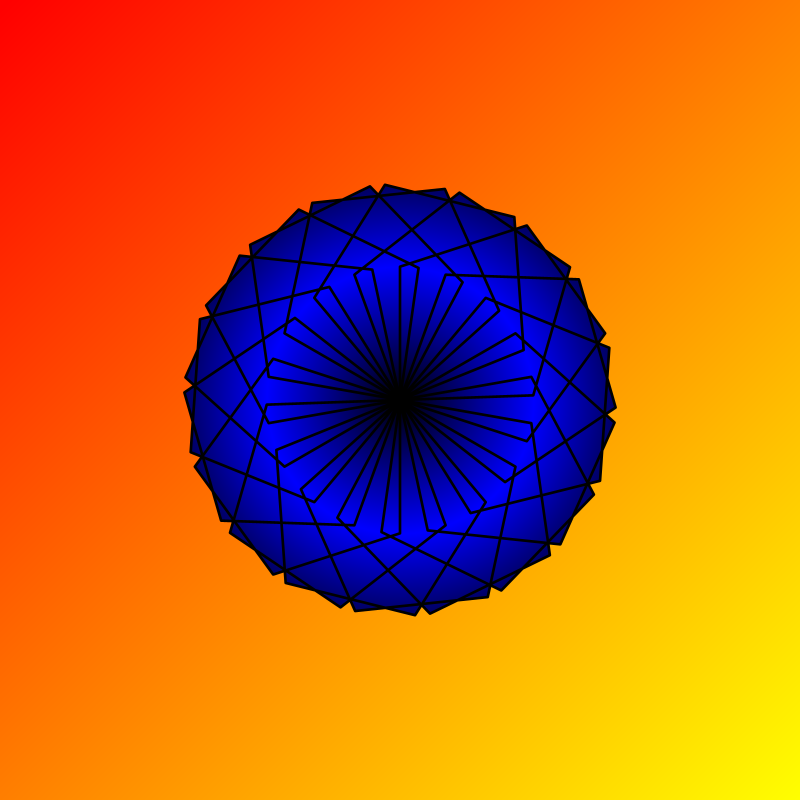

<div class="nav">
  <a href="../../index.html">Home</a> | <a href="index.html">Level 1s Index</a> | <a href="../../tutorials-index.html">Tutorials</a>
</div>

## Linear and Radial gradients

This activity has the following desired goals:
* Learning about linear gradients (**A, M**).
* Learning about radial gradients (**A, M**).
* Learning to apply the above ideas to make pleasing drawings (**M, T**).

---

### Step 1

Type in the following code and run it:

```scala
clear()
setSpeed(fast)
val cb = canvasBounds
val clr = cm.linearGradient(cb.x, cb.y, red, cb.x + cb.width, cb.y + cb.height, yellow, true)
setBackground(clr)
```

**Q1a.** What do you think is a linear color gradient?

**Q1b.** The above code creates a gradient from which point in the canvas to which point?

**Q1c.** What is the start color of the gradient? What is the end color?

---

### Explanation

Function description:

* `cm.linearGradient(x1, y1, c1, x2, y2, c2, cyclic)` - Creates a linear color gradient btween color `c1` at position `(x1, y1)` and color `c2` at position `(x2, y2)`. The `cyclic` parameter specifies whether the gradient should be repeated or not.

---

### Exploration

Create a linear gradient to fill a rectangle.

---

### Step 2

Type in the following code and run it:

```scala
clear()
setSpeed(fast)
val cb = canvasBounds
val clr = cm.radialGradient(0, 0, red, cb.height / 2, yellow, true)
setBackground(clr)
```

### Explanation

Function description:

* `cm.radialGradient(cx, cy, c1, radius, c2, cyclic)` - Creates a radial color gradient btween color `c1` at the center of a circle positioned at `(x1, y1)` and color `c2` at a distance `radius` from the center. The `cyclic` parameter specifies whether the gradient should be repeated or not.

---

### Exploration

Create a radial gradient to fill a rectangle.

---

### Exercise

Write a program to make the following drawing:




