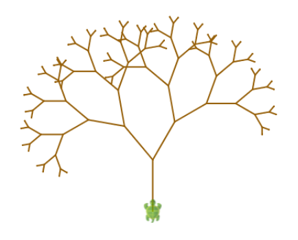

<div class="nav">
  <a href="../../index.html">Home</a> | <a href="index.html">Level 1s Index</a> | <a href="../../tutorials-index.html">Tutorials</a>
</div>

## Recursion

This activity has the following desired goals:
* Learning about self-similar structures (**A, M**).
* Learning to create commands and functions that call themselves (**A, M**).
* Learning to apply the above ideas to make pleasing drawings (**M, T**).

---

### Step 1

Type in the following code and run it:

```scala
def figure(n: Int) {
    forward(n)
    right(90)
    figure(n - 5)
}
clear()
figure(100)
```

**Q1a.** How does the above program work? Trace the program to determine the answer.

**Q1b.** What is wrong with the program?

---

### Step 2

Type in the following code and run it:

```scala
def figure(n: Int) {
    if (n < 10) {
        forward(n)
    }
    else {
        forward(n)
        right(90)
        figure(n - 5)
    }
}
clear()
figure(100)
```

**Q2a.** How does the program in this step improve upon the previous program?

---

### Step 3

Type in the following code and run it:

```scala
def seq(n: Int): Int = {
    if (n == 1) 2 else seq(n - 1) + 3
}
clearOutput()
repeatFor(1 to 5) { e =>
    println(s"${seq(e)}")
}
```

**Q3a.** Does this program use recursion with a command or a function?

**Q3b.** How does the program calulate the desired numbers? Use tracing to find out.

---

### Explanation

* A recursive command or function is useful when the solution to a problem depends on the solution to another (e.g. smaller) version of the same problem.
* A recursive command or function calls itself.
* Within a recursive command or function, you deal with a couple of different cases:
  * The base case. This handles the version of the problem that does not depend on any another version of the problem. The base case leads to the termination of a  recursive solution. Without the base case, a recursive solution will never stop.
  * The recursive case. This handles the version of the problem which depends on another (e.g. smaller) version of the problem.

---

### Exercise 

Write a program to make the something like the following figure (notice how the tree is made out of smaller trees; every tree has two smaller trees within it):


