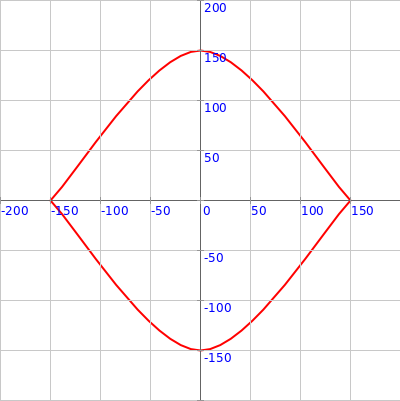

<div class="nav">
  <a href="../../index.html">Home</a> | <a href="index.html">Level 3 Index</a> | <a href="/modules/modules-index.html">Modules</a> | <a href="../../tutorials-index.html">Tutorials</a>
</div>

## Drawing Vertex based shapes using (r, theta) coordinates

This activity has the following desired goals:
* Learning to draw shapes using vertices at (r, theta) cordinates (**A, M**).
* Learning to draw curves using vertices at (r, theta) cordinates (**A, M**).
* Using the above ideas to make interesting curved figures (**M, T**).

---

### Step 1

Type in the following code and run it:

```scala
clear()
showAxes()
showGrid()

def diagonal(x: Double, y: Double) = {
    math.sqrt(x * x + y * y)
}

val r1 = diagonal(50, 50)
val r2 = diagonal(100, 50)
val angle2 = math.atan2(50, 100).toDegrees
val r3 = diagonal(100, 100)

beginShape()
vertexRt(r1, 45)
vertexRt(r2, angle2)
vertexRt(r3, 45)
endShape()
```

**Q1a.** How does the above code differ from the `Step 1` code in the previous lesson?

**Q1b.** What does the `vertexRt(r, theta)` command do?


### Step 2

Type in the following code and run it:

```scala
clear()
setSpeed(fast)
showAxes()
showGrid()

beginShape()
curveVertexRt(150, 0)
curveVertexRt(150, 0)
curveVertexRt(150, 90)
curveVertexRt(150, 180)
curveVertexRt(150, 180)
endShape()
invisible()
```

**Q2a.** Read through the code above and try to understand what it does. What does the above code do? How does it do it?

**Q2b.** What does the `curveVertexRt(r, theta)` command do?

**Q2c.** How many `curveVertexRt(r, theta)` calls are required to make a curve?

**Q2d.** Do the first and last `curveVertexRt(r, theta)` calls play a special role in defining the curve to be made?

---

### Explanation

**Command Descriptions:**

* `beginShape()` - begins a shape made out of vertices.
* `vertexRt(r, theta)` - adds a vertex to the current shape at the given `(r, theta)` location.
* `curveVertexRt(r, theta)` - adds a curve vertex to the current shape at the given `(r, theta)` location.
* `endShape()` - finishes the current shape and draws it out.

 
---

### Exercise

**1** Write a program to make the following figure using two different (`beginShape` plus `curveVertexRt`s plus `endShape`) shapes:




**2** Write a program to make the following figure using four different (`beginShape` plus `curveVertexRt`s plus `endShape`) shapes:


