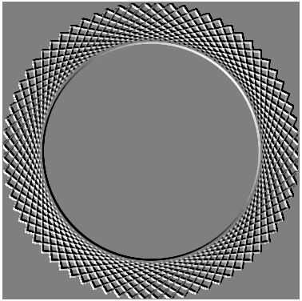

<div class="nav">
  <a href="../../index.html">Home</a> | <a href="index.html">Level 3 Index</a> | <a href="/modules/modules-index.html">Modules</a> | <a href="../../tutorials-index.html">Tutorials</a>
</div>

## Picture Effects

This activity has the following desired goals:
* Learning to apply effects to pictures (**A, M**).

### Step 1

Type in the following code and run it:

```scala
cleari()

val filter1 = new com.jhlabs.image.WeaveFilter
filter1.setXGap(10)
filter1.setXWidth(50)

val filter2 = new com.jhlabs.image.NoiseFilter
filter2.setAmount(100)
filter2.setDensity(1)

val pic = fillColor(red) -> Picture.rectangle(400, 400)
val pic2 = effect(filter1) * effect(filter2) -> pic
drawCentered(pic2)
```


**Q1a.** What do you think the above code does? Explain to a friend.

**Q1b.** What do you think a `WeaveFilter` does? How is it used in the code above?

**Q1c.** What do you think a `NoiseFilter` does? How is it used in the code above?

---

#### Self Exploration

Try out different things in the code above:

1. Use only one filter at a time.
1. Change the filter settings.

---

### Explanation

After you create a picture, you can apply effects to it via image filters. 

Kojo includes a bunch of [image filters from JH Labs](http://www.jhlabs.com/ip/filters/). To use these filters effectively, it's best to (for now) just [look at the JavaDoc in the source code](https://github.com/litan/jhlabs-image-filters/tree/master/src/com/jhlabs/image).

The general approach while using these filters is to:
* create the filter - e.g. `val filter = new com.jhlabs.image.WeaveFilter`
* change the filter parameters (or settings) as desired - e.g. `filter1.setXGap(10)`
* apply the effect to a picture - e.g. `val pic2 = effect(filter) -> pic`
  * multiple effects can be composed together - e.g. `val pic2 = effect(filter1) * effect(filter2) -> pic`
* draw the picture with effects - `draw(pic2)`


---

### Exercise

Write a program to make the following figure. Use a penColor of white and a fillColor of black for the drawing, and use an emboss filter:




