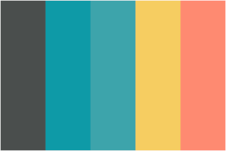

<div class="nav">
  <a href="../../index.html">Home</a> | <a href="index.html">Level 3 Index</a> | <a href="/modules/modules-index.html">Modules</a> | <a href="../../tutorials-index.html">Tutorials</a>
</div>

## Rectangular grids - choosing colors from a palette

This activity has the following desired goals:
* Learning to color a rectangular grid using colors from a palette (**A, M**).
* Making interesting grid based designs (**M, T**).

---

### Step 1

Type in the following code and run it:

```scala
size(600, 600)
cleari()
originBottomLeft()
setBackground(cm.hex(0xF2F5F1))

val tileCount = 30
val tileSize = cwidth / tileCount

val palette = List(0x4a4e4d, 0x0e9aa7, 0x3da4ab, 0xf6cd61, 0xfe8a71).map(cm.hex(_))
def cellColor = randomFrom(palette).fadeOut(0.2)

def shape = Picture.rectangle(tileSize, tileSize)

def block(posX: Double, posY: Double) {
    val pic = shape
    pic.setPosition(posX, posY)
    pic.setPenColor(cm.tomato)
    pic.rotate(random(-5, 5))
    pic.scale(randomDouble(0.95, 1.1))
    pic.setFillColor(cellColor)
    pic.setPenThickness(0)
    draw(pic)
}

repeatFor(rangeTill(0, cheight, tileSize)) { posY =>
    repeatFor(rangeTill(0, cwidth, tileSize)) { posX =>
        block(posX, posY)
    }
}
```

**Q1a.** Read through the code above and try to understand what it does. What does the above code do? How does it do it?

### Explanation

As you can see above, a `palette` is defined as a list of colors, and we randomly select from this sequence to choose a color for any given cell in the grid.

There are many web based sources out there to help you come up with good palettes. Here are a few:
* [colorhunt.co](https://colorhunt.co/palettes/popular)
* [coolers.co](https://coolors.co/)
* [color-hex](https://www.color-hex.com/color-palettes/)
* [36 beautiful palettes](https://digitalsynopsis.com/design/beautiful-color-palettes-combinations-schemes/)

The idea with using the above sources is to select a palette, note down the hex codes of the colors in the palettes, and then put them in the `palette` list in your code (replace the `#` in the web code of the color with `0x` in the hex-value of the color in your code).


---

### Step 2

```scala
size(600, 600)
cleari()
originBottomLeft()
setBackground(cm.hex(0xF2F5F1))

val tileCount = 30
val tileSize = cwidth / tileCount

val palette = List(0x4a4e4d, 0x0e9aa7, 0x3da4ab, 0xf6cd61, 0xfe8a71).map(cm.hex(_))
val weights = List(1, 10, 1, 10, 3)
def cellColor = randomFrom(palette, weights)

def shape = Picture.rectangle(tileSize, tileSize)

def block(posX: Double, posY: Double) {
    val pic = shape
    pic.setPosition(posX, posY)
    pic.setPenColor(cm.tomato)
    pic.rotate(random(-5, 5))
    pic.scale(randomDouble(0.95, 1.1))
    pic.setFillColor(cellColor)
    pic.setPenThickness(0)
    draw(pic)
}

repeatFor(rangeTill(0, cheight, tileSize)) { posY =>
    repeatFor(rangeTill(0, cwidth, tileSize)) { posX =>
        block(posX, posY)
    }
}
```

**Q2a.** Read through the code above and try to understand what it does. What does the above code do? How does it do it?

**Q2b.** What does the above code do different - compared to the code in `step 1`.

### Explanation

In step 2, we give different weights to the different colors in a palette. Let's look at the palette used above:



Let's say you want more of the first, fourth, and fifth colors in the palette, and very little of the second and third colors. You can do this by using a weight sequence of `List(10.0, 1, 1, 10, 10)`. This gives ten times more weightage to the first, fourth, and fifth colors:

---

### Exercise

Write a program to make a design using the above ideas.


