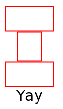
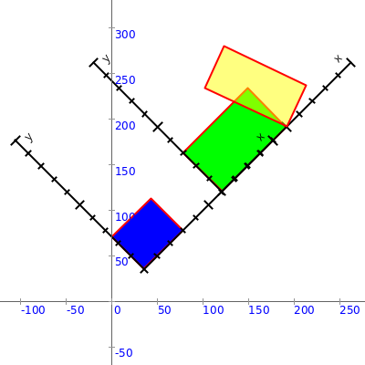

<div class="nav">
  <a href="../index.html">Home</a>
</div>

## An introduction to pictures
A picture is a visual element in Kojo. To work with a picture, you do the following:
* [Create the picture](#picture-creation)
* [Transform it](#picture-transformation) (optional)
* [Lay it out by aligning it with other pictures](#picture-layout) (optional)
* Attach mouse event handlers to it (optional)
* Draw it
* Animate it as you continue to transform it (optional)
* Check for collisions with other pictures (optional)
* Interact with it as a user via the event handlers(optional)

The above Picture capabilites enable the following:
* Functional art
* Generative art
* Gaming

### Picture creation
Pictures can be created in many different ways using any one of the following functions:  
*Note* - these pictures are located at at the canvas position (0, 0) to begin with. They can be positioned at any other location by using the setPosition command or being part of a row, column, or stack of pictures.

| Function | Description |
| :--- | :--- |
| `Picture {turtle drawing code}` | Creates a picture from the given turtle drawing. |
| `Picture.line(width, height)` | Creates a picture of a line with the given width and height. |
| `Picture.rectangle(width, height)` | Creates a picture of a rectangle with the given width and height. |
| `Picture.circle(radius)` | Creates a picture of a circle with the given radius. The center of the circle is at (0, 0) |
| `Picture.ellipse(xRadius, yRadius)` | Creates a picture of an ellipse with the given xRadius and yRadius. The center of the ellipse is at (0, 0) |
| `Picture.ellipseInRect(width, height)` | Creates a picture of an ellipse with the given width and height. |
| `Picture.point` | Creates a picture of a point. |
| `Picture.arc(radius, angle)` | Creates a picture of an arc with the given radius and angle. The center of the arc is at (0, 0). |
| `Picture.text(string)` | Creates a picture with the given text. |
| `Picture.hgap(width)` | Creates an invisible picture with the given width. This can be useful during picture layout |
| `Picture.vgap(width)` | Creates an invisible picture with the given height. This can be useful during picture layout |
| `Picture.image(fileName)` | Creates a picture with the image in the given file. |
| `Picture.image(url)` | Creates a picture with the image at the given file link. |
| `Picture.image(image)` | Creates a picture with the given image. |

#### Example

```scala
cleari()
val pic1 = Picture.rectangle(100, 50)
val pic2 = Picture.circle(50)
draw(pic1, pic2)
```

#### Exercise

Use all the picture creation functions listed above to create and draw pictures.

### Picture Transformation
You can transform pictures in the following main ways (every transformation below is shown via a tranformation object/function and a transformation method/command):

| Transformation | Object/function | Method/command |
| :--- | :--- | :--- |
| rotate | `rot(angle) -> pic` | `pic.rotate(angle)` |
| scale | `scale(f) -> pic` | `pic.scale(f)` |
| translate (in its local coordinate system) | `trans(x, y) -> pic` | `pic.translate(x, y)` |
| translate (in its parent's coordinate system) | `offset(x, y) -> pic` | `pic.offset(x, y)` |
| position at a given location | `offset(x, y) -> pic` (one time) | `pic.setPosition(x, y)` |
| change pen color | `penColor(color) -> pic` | `pic.setPenColor(color)` |
| change pen thickness | `penThickness(t) -> pic` | `pic.setPenThickness(t)` |
| change fill color | `fillColor(color) -> pic` | `pic.setFillColor(color)` |

As shown above, there are two distinct ways of doing picture transformations:
* the object/function way, e.g., `trans(100, 0) -> pic` - which is useful while doing functional graphics. This way of doing transformations can be used only before a picture is drawn.
* the method/command way, e.g.. `pic.translate(100, 0)` - which is useful while doing generative art or gaming. This way of doing transformations can be used before and after a picture is drawn.


Multiple transformations can be combined in the following ways:
* tranformation objects/functions are combined using `*`, e.g., `trans(100, 0) * rot(45) -> pic`
* transformation methods/commands are combined by sequential calls, e.g., `pic.translate(100, 0); pic.rotate(45)`


#### Examples

```scala
cleari()
showAxes()
val pic = trans(100, 0) * rot(45) * penColor(blue) -> Picture.rectangle(100, 50)
draw(pic)
```

```scala
cleari()
showAxes()
val pic = Picture.rectangle(100, 50)
pic.translate(100, 0)
pic.rotate(45)
pic.setPenColor(blue)
draw(pic)
```

### Picture Layout
Multiple pictures can be laid out in the following ways:

| Layout type | Function for layout (with centering) | Function for layout (without centering) |
| :--- | :--- | :--- |
| stack - one on top of the other | `picStackCentered(pic1, pic2, ...)` | `picStack(pic1, pic2, ...)` |
| row - left to right | `picRowCentered(pic1, pic2, ...)` | `picRow(pic1, pic2, ...)` |
| column - bottom to top | `picColCentered(pic1, pic2, ...)` | `picCol(pic1, pic2, ...)` |

#### Examples

```scala
cleari()
showAxes()
val pic1 = Picture.rectangle(50, 50)
val pic2 = Picture.rectangle(100, 50)
val pic3 = Picture.rectangle(50, 100)
val pics = picColCentered(pic1, pic2, pic3)
draw(pics)
```

```scala
cleari()
showAxes()
val pic1 = Picture.rectangle(50, 50)
val pic2 = rot(45) * fillColor(blue) -> Picture.rectangle(100, 50)
val pic3 = scale(1.5) * penColor(green) -> Picture.rectangle(50, 100)
val pics = picColCentered(pic1, pic2, pic3)
draw(pics)
```

```scala
cleari()
showAxes()
val pic1 = Picture.rectangle(100, 50)
val pic2 = picRowCentered(Picture.rectangle(25, 50), Picture.hgap(48), Picture.rectangle(25, 50))
val pic3 = Picture.rectangle(100, 50)
val pics = picColCentered(pic1, pic2, pic3)
draw(pics)
```

#### Exercise
Write programs to make the figures shown below using the following instructions:
* `Picture.rectangle`
* `Picture.text`
* `Picture.hgap`
* `picColCentered`
* `picRowCentered`
* `penColor`
* `draw`





#### Picture coordinate systems

The following example shows you three different coordinate systems in action when you create a transformed row of pictures.

**Program**:
```scala
cleari()
val pic1 = trans(60, 0) -> Picture.rectangle(60, 50)
val pic2 = rot(20) -> Picture.rectangle(100, 60)
val pic3 = Picture.rectangle(50, 100)
val pics = rot(45) * trans(50, 0) -> picRow(pic1, pic2, pic3)
draw(pics)
showAxes()
Picture.showAxes(pics, pic2)
```

**Output**:


In the figure above, you see the axes for the following coordinate systems:
* The canvas coordinate system
* The coordinate system for `pics`, which lives within the coordinate system of its parent - the canvas
* The coordinate system for `pic2`, which lives within the coordinate system of its parent - `pics`.
